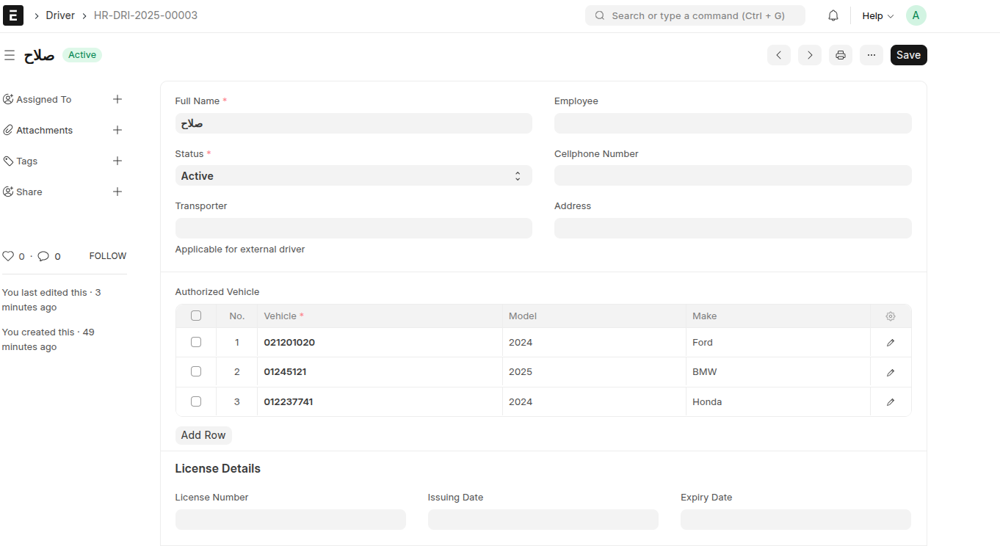
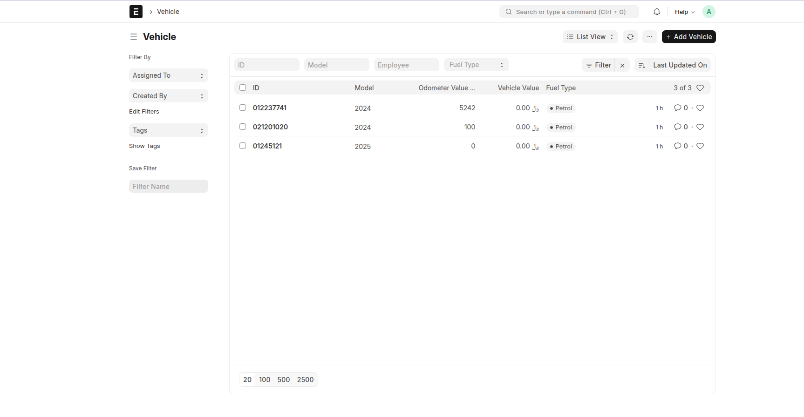
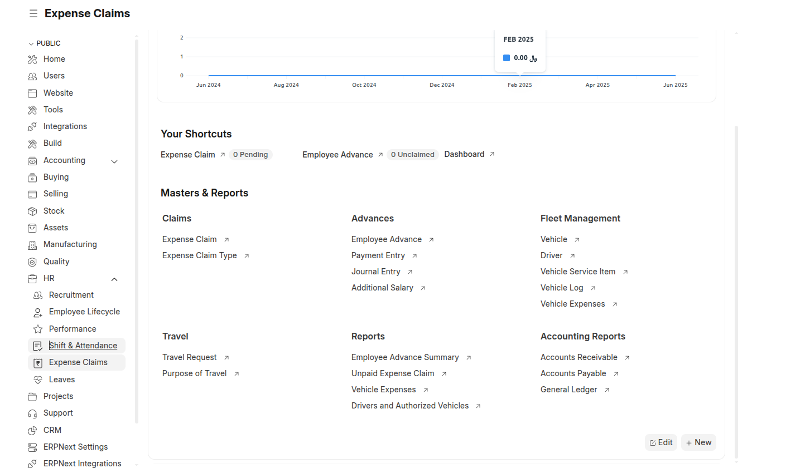
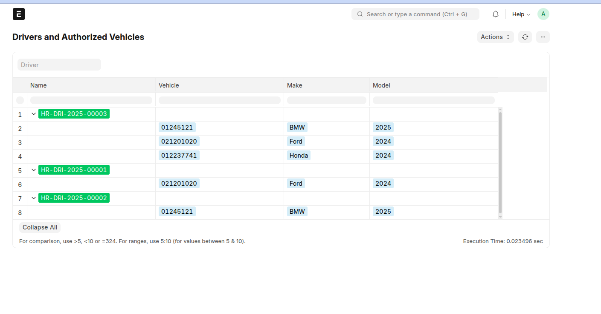
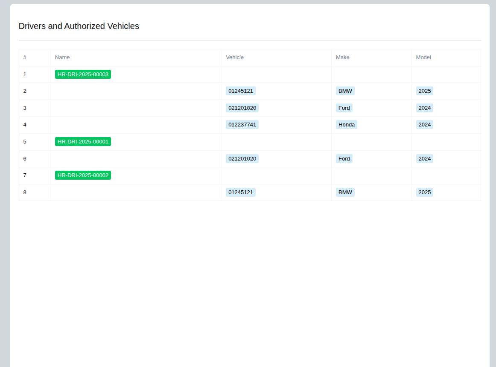

# 🧠 smart_solutions – ERPNext Driver Fleet App
A smart chip for managing drivers and vehicles within ERPNext via a tree interface and advanced reports.







## 🚀 Features

- Link drivers to multiple vehicles.
- Formatted tree report.
- Automatically customize fields and workspace.
- Attractive PDF printable template.
- Contains experimental data

## 🔧 Installation

```bash
bench get-app https://github.com/abdoasofi/smart_solutions
bench --site your-site install-app smart_solutions
bench migrate
bench restart